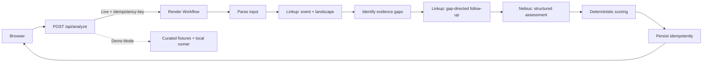

# PIVOT!

> **Before you spend 36 hours building it, check the odds.**

PIVOT! is an AI hackathon mentor that researches before it judges. It verifies the target event, investigates the idea landscape in two evidence rounds, evaluates ten mentor dimensions, and tells a team whether to **FOLD, PIVOT, DOUBLE DOWN, or ALL IN**—plus exactly what to build next.

The problem is not a lack of ideas. It is spending a scarce hackathon weekend on an idea that is vague, undifferentiated, impossible to demonstrate, or padded with decorative sponsor integrations.

**[Try the public Demo Mode](https://pivot-idea-casino.valecreativo.chatgpt.site/)** · [Architecture](#architecture) · [Sponsor integrations](#sponsor-integrations) · [Demo scripts](docs/DEMO-SCRIPT.md)

## How it works

1. Read the supplied event from its own domain and collect tracks, sponsors, judging criteria, prizes, rules, and deadlines.
2. Research competitors, technical precedent, user evidence, and adoption separately so the event query is not diluted by the project pitch.
3. Save Round 1, identify material unknowns, and make those gaps the input to Round 2.
4. Ask Nebius for a strict, structured ten-dimension mentor assessment.
5. Derive score, edge scores, verdict, and near-miss deterministically in application code.
6. Return a scoped MVP, exclusions, 24–36 hour build plan, 60-second demo plan, and inspectable research trail.

## Product status

- Complete zero-key Demo Mode with five tailored scenarios, deterministic reports, two research rounds, explicit evidence gaps, fixture-source labeling, and uncertainty.
- Ten-dimension 100-point rubric with deterministic verdicts: FOLD, PIVOT, DOUBLE DOWN, and ALL IN.
- Separate **Hackathon Edge** and **Real-World Edge** scores with transparent dimension weights.
- Constructive near-miss mechanic that names the changes with the highest expected point impact.
- Clearly labeled Demo and Live modes; simulated evidence and recovery never appear as live execution.
- A confirmed production Vercel → Render → Linkup → Nebius run completed end-to-end. Live provider failures remain visible and never fall back to fixtures.
- Detailed mentor report: strengths, weaknesses, sources, novelty, adoption, feasibility, sponsor fit, stronger pivot, five-feature MVP, exclusions, 24-hour plan, and 60-second demo.
- Inspectable 15-case mentor benchmark with misses disclosed.
- Server-only Linkup and Nebius adapters, a Render Workflow task graph, D1 persistence, and validated external AI output.

## Run locally

Requires Node 22.13+.

```bash
npm install
npm run dev
```

Open the local URL printed by the development server. No environment variables are needed. Pick a demo hand, optionally enable the failure simulation, and run the odds.

Quality checks:

```bash
npm test
npm run lint
npm run build
```

## Architecture



Live task graph: `parse_input → research_hackathon → identify_gaps → followup_research → evaluate_with_nebius → generate_pivot → persist_report`.

The browser receives no sponsor credentials. In Live Mode, `/api/analyze` starts `pivot-analysis/run_analysis` with exactly two positional arguments—validated input and idempotency key—then polls the real Render run to completion. The interface identifies its moving phase marker as anticipation because child-task status is not streamed to the browser; it only labels the final Render status as confirmed.

## Score formula

The PIVOT Score is the sum of ten rubric dimensions: problem clarity 10, user specificity 8, novelty 12, real-world feasibility 12, hackathon scope 12, demoability 10, sponsor fit 10, business/adoption 10, impact 8, and evidence 8.

Hackathon Edge averages normalized novelty, feasibility, scope, demoability, and sponsor-fit dimensions. Real-World Edge averages problem clarity, user specificity, feasibility, adoption, impact, and evidence. Application code derives the overall score, both edge scores, verdict tier, and near-miss distance from the canonical dimensions; confidence and evidence coverage remain visible risk signals but cannot change those tier boundaries.

## Sponsor integrations

- **Linkup — research:** first-party target-event retrieval and a separate idea-landscape search feed gap analysis; each material unknown becomes a targeted Round 2 query. Sources, relevance, confidence, and unresolved unknowns remain inspectable.
- **Nebius Token Factory — inference:** GLM-5.3-Flash produces the strict ten-dimension assessment in the main flow. PIVOT validates it with Zod, while application code—not the model—calculates the final scores and verdict.
- **Render Workflows — orchestration:** seven child tasks preserve successful research across downstream work. Network, rate-limit, and provider errors retry at the smallest meaningful boundary; deterministic format errors fail fast; an idempotency key prevents duplicate reports.

## Live mode

Copy `.env.example` to `.env.local`, set the credentials below, and choose `APP_MODE=live` (or `auto`). All keys remain server-side.

### Linkup — recursive evidence gathering

1. Create an account and API key at [app.linkup.so](https://app.linkup.so/).
2. Set `LINKUP_API_KEY`.
3. Start the app with `APP_MODE=live`.
4. Run an analysis and confirm the Research Trail labels actual URLs as `LIVE SOURCE`.

PIVOT calls Linkup separately for target-event evidence and the idea landscape. First-party event-domain results receive explicit provenance; missing tracks, criteria, sponsors, competitors, or adoption evidence become targeted Round 2 searches. The implementation uses the official `POST https://api.linkup.so/v1/search` endpoint with `searchResults`; see the [Linkup quickstart](https://docs.linkup.so/pages/documentation/get-started/quickstart).

### Nebius Token Factory — main-flow mentor inference

1. Create an account at [Token Factory](https://tokenfactory.nebius.com/) and create an API key.
2. Set `NEBIUS_API_KEY`.
3. Keep the default `NEBIUS_BASE_URL`, or change it for a compatible endpoint.
4. Select a current JSON-capable model in Token Factory and set `NEBIUS_MODEL`.
5. Run the 15 benchmark cases before a public demo and record actual latency/cost.

PIVOT sends the idea, constraints, hackathon context, both evidence rounds, gaps, and rubric to the OpenAI-compatible chat-completions endpoint. It requests JSON, extracts fenced or noisy JSON defensively, and validates the result with Zod. See [Nebius quickstart](https://docs.tokenfactory.nebius.com/quickstart) and [structured output guidance](https://docs.tokenfactory.nebius.com/ai-models-inference/json).

### Render Workflows — durable orchestration

1. Install the Render CLI and run `render workflows init` if you want a separate starter; this repository already contains task definitions in `render-workflow/tasks.ts`.
2. Push this repository to a supported Git provider.
3. In Render, choose **New → Workflow**, link the repository, choose Node, use `npm install` as the build command and `npm run workflow:start` as the start command.
4. Add the Linkup and Nebius variables to the Workflow service.
5. Deploy, then copy the registered task slug for `run_analysis` (format `workflow-slug/run_analysis`).
6. Create a Render API key, set it as `RENDER_API_KEY`, and set the task slug as `RENDER_WORKFLOW_ID` in the web app.
7. Trigger once and inspect the chained tasks and retry boundaries in Render’s Runs view.

In live mode, `/api/analyze` calls the official `POST https://api.render.com/v1/task-runs` endpoint with the positional input array `[analysisInput, idempotencyKey]`, polls `GET /v1/task-runs/{runId}` to a terminal state, and returns the workflow's report result. It never falls back to the local runner after a Render failure. Research and persistence children retain bounded retries; Nebius retries only transient network, 429, and 5xx failures inside its provider, while deterministic JSON/schema failures fail fast. The idempotency key also derives a stable analysis ID. See [workflow setup](https://render.com/docs/workflows-tutorial), [task definitions and retries](https://render.com/docs/workflows-defining), and [triggering runs](https://render.com/docs/workflows-running).

## Persistence

D1 stores each analysis once and findings under a unique `analysisId:findingId` key. Upserts make retries safe. Local workflow results still return if persistence is temporarily unavailable. The generated migration is committed in `drizzle/`.

## Mentor benchmark

The benchmark is intentionally labeled directional expert judgment, not objective truth. It spans vague climate AI, developer tools, marketplaces, hardware, public-good blockchain, wrappers, impossible scope, social impact, forced and native sponsors, consumer apps, infrastructure, research, fun builds, and deceptively simple concepts. The displayed 15-case values are checked-in fixture baselines; they were not regenerated with fifteen paid calls against the final GLM integration.

## Known limitations

- Web search can still miss, rank, or summarize imperfect evidence. PIVOT keeps unverified claims and missing first-party event evidence visible rather than treating retrieval as truth.
- Model judgments remain judgments even when schema-valid. Deterministic scoring prevents internal arithmetic contradictions but does not make the rubric objective.
- Demo evidence is curated fixture content and uses clearly non-public `demo-evidence.local` URLs; it is never presented as web research.
- D1 persistence is device-independent when hosted, but there is intentionally no account/history interface.
- Benchmark “ground truth” reflects mentor judgment; disagreement is disclosed rather than hidden.

## Tracks

- **Linkup / Deep Research:** recursive, gap-driven research with source provenance.
- **Nebius / Applied AI:** structured main-flow mentor inference plus an inspectable benchmark.
- **Render / Workflows:** separate retryable steps, idempotency, visible failure recovery.
- **NERDCONF / Fun Build:** a memorable casino decision terminal that teaches disciplined scope.

See [track compliance](docs/TRACK-COMPLIANCE.md), [90-second and 2-minute demo scripts](docs/DEMO-SCRIPT.md), and [submission copy](docs/SUBMISSION.md).
